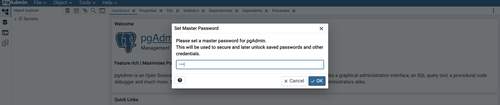
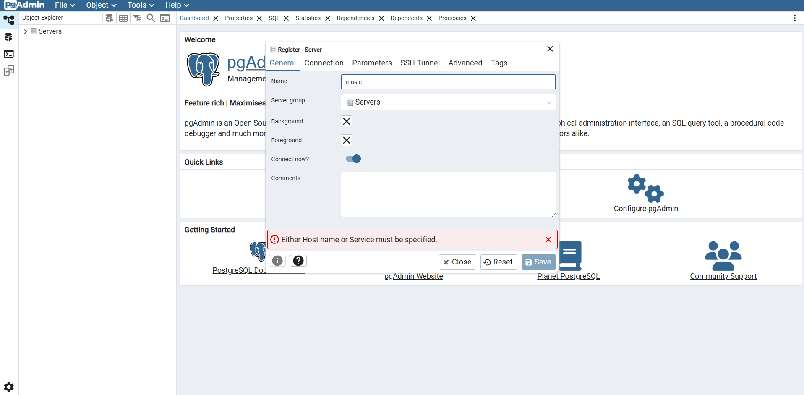
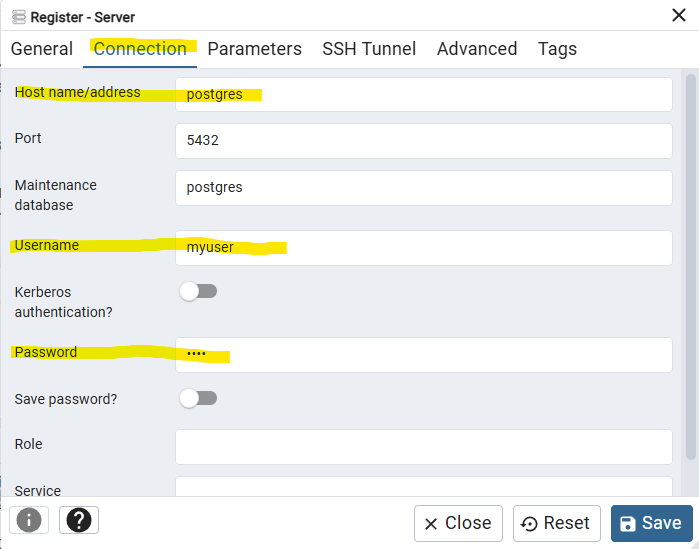

# Overview

This project implements a music-themed application that allows users to manage songs and playlists. The primary focus is on demonstrating unit testing practices using JUnit and Mockito frameworks.
You can find postman collection available in `resources/static`

To enable unit testing with JUnit and Mockito, add the following dependency to your `pom.xml`:
```
<dependency>
    <groupId>junit</groupId>
    <artifactId>junit</artifactId>
    <version>{version}</version>
    <scope>test</scope>
</dependency>
```


### Connect to database

There is .env file in the project root for environment variables, you can pick this one, but you are free to change data : 

```
POSTGRES_USER=myuser
POSTGRES_PASSWORD=1234
POSTGRES_PORT=5432
POSTGRES_DB_URL=jdbc:postgresql://localhost:5432/music_db

PGADMIN_DEFAULT_EMAIL=admin@email.com
PGADMIN_DEFAULT_PASSWORD=1234
PGADMIN_PORT=80

```

The database is dockerized, you can type this command in terminal :
```
"docker compose up -d" 
```

You can connect to pgadmin : add the server and connect to database.




Since there is no specified network in our docker-compose and docker give by default a private network to our services, 
you can type the name of the database service in docker-compose : "postgres". 




